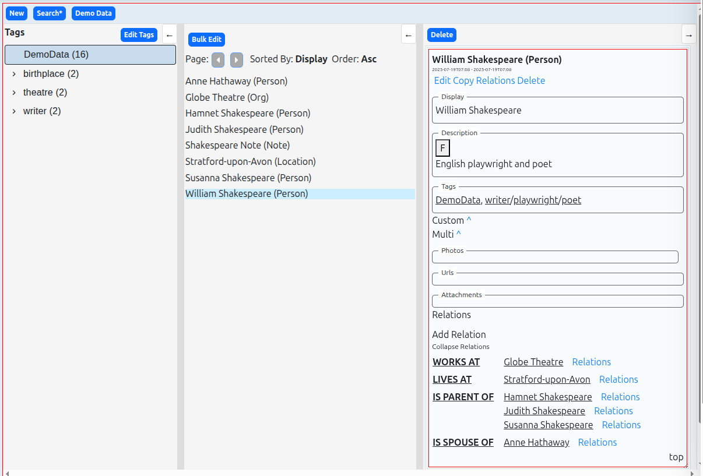
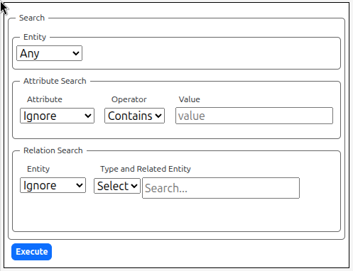
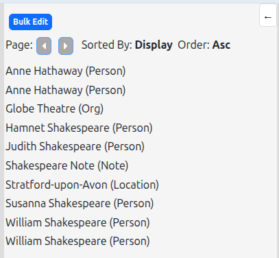
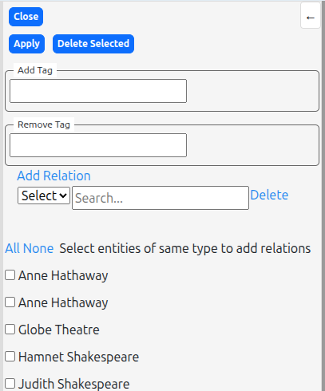
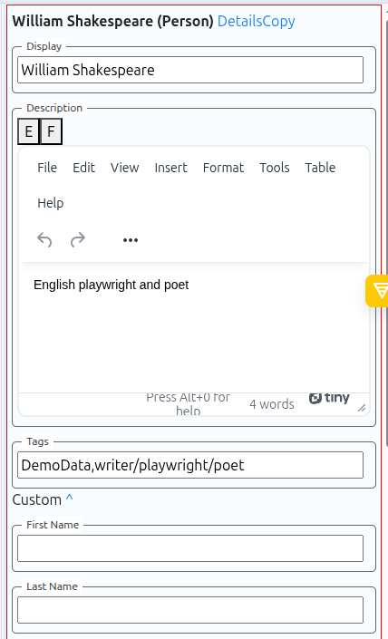
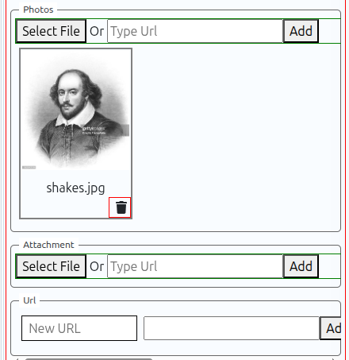
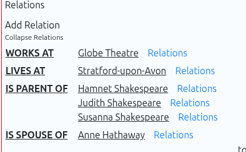

# Knowledge Graph App – Design Document

## Overview

The ERM application allows users to manage multiple types of entities and their relationships. It is designed with a consistent and interactive three-panel layout and a top control bar. The system supports rich data structures, tagging, media attachments, and powerful relationship management.

---

## Supported Entity Types

- **Common Fields**:
  - `display` (string)
  - `description` (rich text)
  - `tags` (hierarchical)
  - `photos` 
  - `attachments` 
  - `urls` 

- **Custom Fields per Entity Type**:

`Note: Date Time (date time selector)`  
`Person: Profession|Last Name|First Name|Phone|dob|E Mail`  
`Org:Name|Kind (drop down)`  
`Location Address 1|Address 2|Postal Code|City|State|Country`  
`Movie:	 year|language|country`  
`Book: Year|Language|Country|Summary`

---

## UI Layout

### 🔝 Top Control Panel

- `New`: Create a new entity
- `Search`: Toggle search panel
- `Demo Data`: Load sample data

---

### 📂 Left Panel: Tag Tree

#### Structure

- Hierarchical tree view with expandable/collapsible nodes
- Each tag shows:
  - Tag name
  - Cumulative entity count (includes children)

#### Features

- **Select Tags**: Multi-select to combine with search filters
- **Edit Mode**: Enabled by clicking `Edit Tags`:
  - `Add Tag`: Creates a new tag under selected (or root)
  - `Delete Selected Tags`
  - Rename tag inline using pencil icon

---

### 🔍 Top Bar → Search Panel

#### Entity Attribute Filter

- Select entity type
- Choose attribute based on type
- Operator: equals, contains, starts with, etc.
- Value input

#### Relationship Filter

- Source entity type
- Relation type selector
- Target entity (autocomplete by display name)

#### Execute

- Combines filters with selected tags
- Results shown in central panel

---

### 🧮 Central Panel: Search Results

#### Layout

1. **Top Control Panel**: `Bulk Edit` button
2. **Sort/Pagination**:
   - Sort by display, modified, created
   - Asc/Desc toggle
   - Pagination active if >20 results
3. **Results List**:
   - Displays display name + entity type
   - Clicking shows entity in right panel

#### Bulk Edit Mode

- Checkbox per result
- Actions:
  - Add/Remove Tags
  - Delete selected
  - Add Relation(s):
    - Relation type
    - Target entity (autocomplete)
  - Add multiple relation rows
  - Close to exit bulk mode

---

### 📋 Right Panel: Entity Detail View

#### Modes

- **Detail** (default): Shows all fields + media + relations
- **Edit**: Turns all fields into editable form

#### Features

- Description is a rich-text editor
- Add photos/attachments via file upload or URL. Labels can be edited in edit mode  
- 
- Add URLs (name + url)

### Relation Handling

- Inline relation view in both detail and edit modes
- Grouped by type
- Clicking a related entity opens it in the right panel
- Related entities also highlighted in center (if shown)
- Clicking `relations` shows relation view of that entity
- Edit mode adds delete buttons for relations

In addition to the `Edit` button, there is a `Relations` button in the right panel header.
- This toggles a dedicated view for relationship management (same as the inline section at the bottom of the detail panel).

## 🔗 Relationship Panel

- Relationships are:
  - Grouped by **relation type** (left column)
  - Labeled by **relation name** (middle column)
  - Linked to the **related entity** (right column), with a clickable `Relations` link

### 🧭 Interactions

- Clicking a related entity:
  - Loads that entity into the right detail panel
  - If it is also present in the center panel, it becomes **highlighted**

- Clicking the `Relations` link beside a related entity:
  - Loads the relationship view for that entity

### ✏️ Edit Mode

- When the `Edit` button is active, an `Edit Relations` button is available
- Enables:
  - A delete icon next to each existing relation
  - Clicking the delete icon removes that relation immediately

---

## 🔄 Panel Synchronization

All panels stay consistent:
- Tag changes update tag tree + counts
- Entity edits/deletes update central panel and relations
- Navigation or relation edits update right and center panels

---

